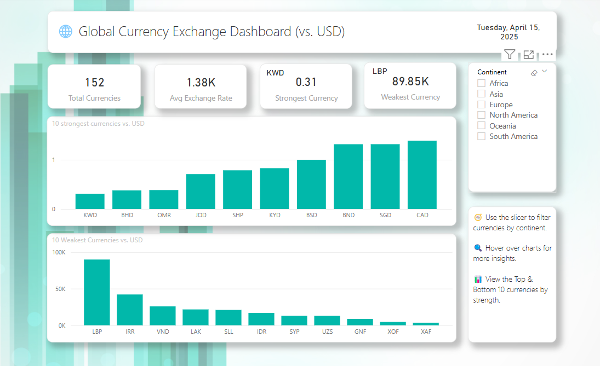

# 🌍 Global Currency Exchange Dashboard

This Power BI dashboard visualizes real-time foreign exchange rates across global currencies. Built in under 24 hours, this project transforms raw API data into interactive insights — showcasing top and bottom performing currencies, average exchange trends, and region-based filtering.

---

## 📊 Key Features

- ✅ **Live data** from a public exchange rate API
- 💱 **Top 10** and **Bottom 10** performing currencies (vs USD)
- 📌 **KPI cards** for:
  - Strongest currency
  - Weakest currency
  - Average exchange rate
- 🌍 **Slicer** to filter currencies by continent/region
- ⚡ Completed in under **24 hours** as a data storytelling challenge

---

## 🧰 Tools & Tech Stack

- **Power BI Desktop**
- **DAX** for dynamic calculations
- **Public API** from [exchangerate.host](https://api.exchangerate.host/live)
- Power Query (for data connection and transformation)

---

## 📈 Visuals Preview

> Full dashboard view showing KPIs, ranked currencies, and filtering options.

---

## 🔗 Live Demo & Files

- 🔗 GitHub Repository: https://github.com/Mzu-Soci/Global-Currency-Dashboard.git 
- 📁 Power BI File: [`Currency Exchange Rate Dashboard.pbix`](./Currency Exchange Rate Dashboard.pbix)
- 📸 Assets folder: Screenshots and sample visuals

---

## 🚀 Getting Started

1. Clone or download the repo
2. Open the `.pbix` file in Power BI Desktop
3. Refresh to pull the latest exchange rate data (requires internet)
4. Explore the dashboard and apply region filters

---

## 💡 Future Improvements

- Enable scheduled refresh via Power BI Service
- Add trendlines to show historical changes over time
- Incorporate data on inflation or GDP for macroeconomic insights

---

## 🙋‍♂️ About Me

Hi, I’m **Mzukisi** – passionate about using data to solve real-world problems in finance, compliance, and beyond. This project is part of my **Power BI portfolio**, and I’d love your feedback!

- 💼 LinkedIn: www.linkedin.com/in/mzukisi-soci
- 📫 Email: mzu.soci@holiwota.co.za
- 🧠 More Projects: https://github.com/Mzu-Soci

---

## 📣 Feedback & Contributions

If you have suggestions or ideas for improvement, feel free to open an issue or fork the project!

---

